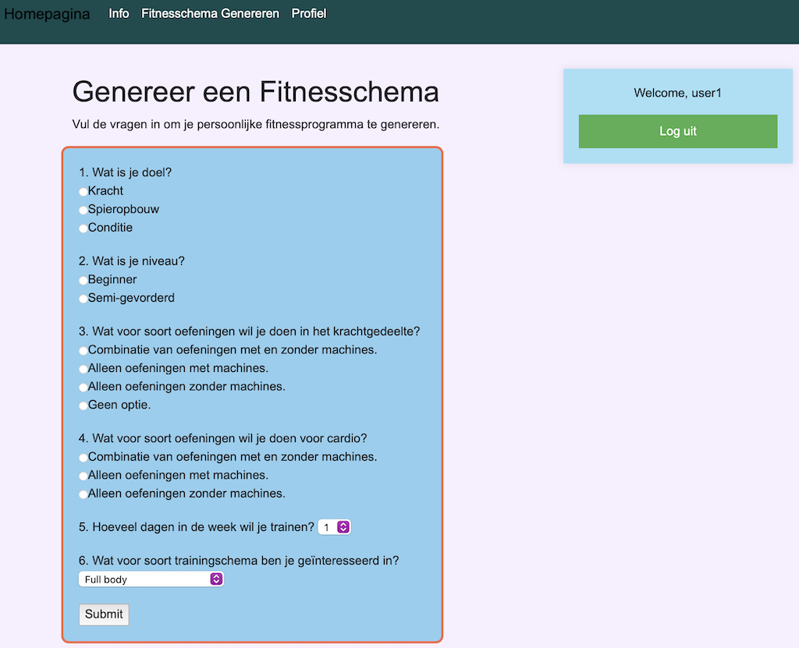
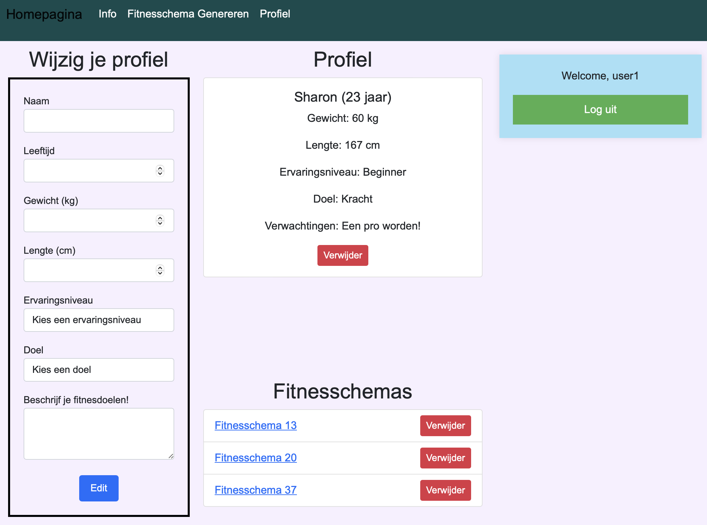
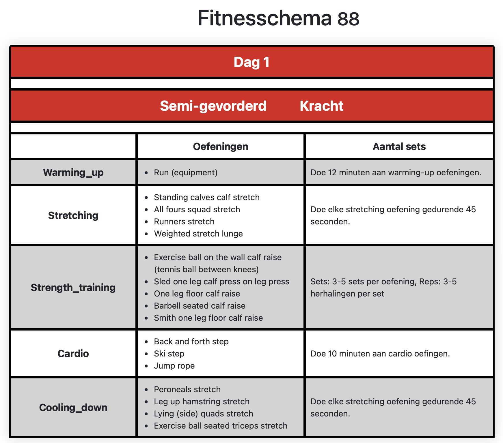
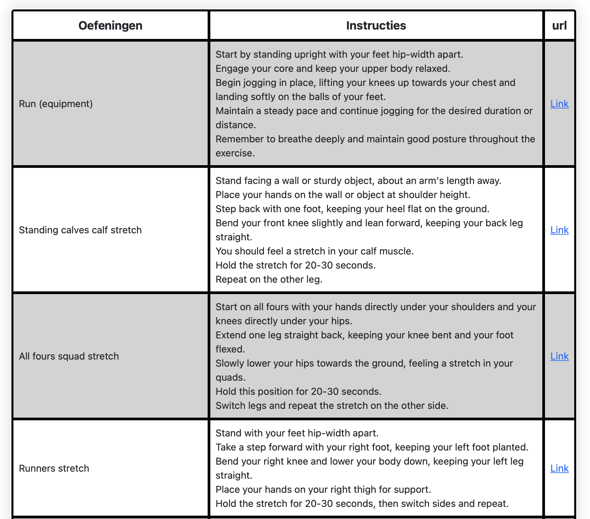

# Project Fitnesschema Generator
**Acteur:  Deveney Etnel**

## Demo Video
[!Demo video](https://video.uva.nl/media/Fitnesschema_generator/0_mb2dcb11)

<div style="display: flex; flex-wrap: wrap;">
  
  
</div>

<div style="display: flex; flex-wrap: wrap;">
  
  
</div>

<div style="display: flex; flex-wrap: wrap;">
  
</div>

## Beschrijving

De Fitness Schema Generator is een webapplicatie die gepersonaliseerde fitnessschema's genereert voor vrouwen vanaf 18 jaar, zowel beginners als semi-gevorderden. De generator bevat 180 verschillende fitnessschema's die gericht zijn op het verbeteren van de conditie, spieropbouw en kracht.

### Functies

- **Beheer van Profielen:** Maak en beheer je persoonlijke profiel.
- **Opslaan van Gepersonaliseerde Schema's:** Fitnessschema's worden opgeslagen in je profiel zodat je ze altijd kunt terugkijken.
- **Informatie en Instructies:** Krijg meer informatie over fitness en gedetailleerde instructies voor elke oefening.
- **Gepersonaliseerde Oefeningen:** Kies oefeningen met of zonder machines, of een combinatie van beide.
- **Verschillende Trainingsschema's:** Kies uit verschillende soorten schema's zoals full body, splitschema, upper body, lower body, en push/pull/legs-schema.
- **Gedetailleerde Sets:** Specifieke informatie over het aantal herhalingen en sets per oefening.
- **Overwegingen en Tips:** Ontvang aanbevelingen voor het juiste gewicht, rustperiodes en meer.

## Installatie
### PostgreSQL installatie en configuratie
Om dit project te gebruiken, moet je een PostgreSQL-database opzetten om te gebruiken met je applicatie. PostgreSQL is ontworpen om te draaien als een zelfstandige service (een apart programma dat op je machine draait of misschien op een server) waar een app mee kan communiceren. Volg de onderstaande stappen om PostgreSQL te installeren en te starten:

#### Mac met Homebrew:
```bash
brew install postgresql
```
Voor meer informatie kun je ook de officiële documentatie van Homebrew bekijken: [PostgreSQL Wiki](https://wiki.postgresql.org/wiki/Homebrew)

#### WSL op Windows:
Volg deze instructies: [Install PostgreSQL on WSL](https://learn.microsoft.com/en-us/windows/wsl/tutorials/wsl-database#install-postgresql)

Zodra PostgreSQL is geïnstalleerd, voer je het volgende uit om PostgreSQL te starten:

**Mac met Homebrew:**
```bash
brew services start postgresql
```
**WSL op Windows:**
```bash
sudo service postgresql start
```
Deze opdrachten starten PostgreSQL op de achtergrond. Als je het programma wilt stoppen, vervang dan simpelweg het woord `start` door `stop` in de opdracht hierboven.

We gaan nu een nieuwe database creeren.

1. Start PostgreSQL: Voer het volgende commando uit om PostgreSQL te starten:
```bash
brew services start postgresql@14
```
2. Verbinding maken met PostgreSQL: Gebruik het volgende commando om verbinding te maken met de PostgreSQL-database:
```bash
psql postgres
```
3. Maak een nieuwe database: Binnen de PostgreSQL CLI voer je het volgende commando uit om een nieuwe database aan te maken:
```bash
CREATE DATABASE sportschemas;
```
4. Verbinding maken met de nieuwe database: Gebruik het volgende commando om verbinding te maken met de nieuwe database die je zojuist hebt aangemaakt:
```bash
\c sportschemas
```
Dat is alles! Met deze bash-opdrachten kun je PostgreSQL starten, verbinding maken met de PostgreSQL-database, een nieuwe database aanmaken en ermee verbinden.
Volg deze stappen voordat je doorgaat met de installatie van de applicatie.

## Applicatie installatie

1. Clone de repository:
```bash
git clone https://github.com/minprog-platforms/project-deffie2
```
2. Installeer de vereiste pakketten:
```bash
python3 -m pip install -r requirements.txt
```
3. Configureer de database
  * Maak een PostgreSQL database aan
  * Voeg de database URL toe aan je omgevingsvariabelen:
```bash
export DATABASE_URL="postgresql://localhost/sportschemas"
```
4. Maak de database tabellen aan:
```bash
python3 create.py
```
   
5. Laad de gegevens in de database:

    5.1 Laad fitnesschema's en sets uit CSV-bestanden:
    * Gebruik het script import1.py om de gegevens te laden. Voer de volgende commandoregel uit:
    ```bash
      python3 import1.py
    ```
    5.2 Laad oefeningengegevens van een externe API:
    * Ga naar de [API-pagina](https://rapidapi.com/justin-WFnsXH_t6/api/exercisedb)
    * Kies het basisplan en maak vervolgens een account aan.
    * Gebruik het script `import0.py` om de gegevens van de externe API in je database te laden. Voer de volgende commandoregel uit:
    ```bash
    python3 import0.py
    ```
6. Start de ontwikkelingsserver:
```bash
python3 -m flask --debug run
```
7. Open de applicatie in je browser:
```arduino
http://127.0.0.1:5000
```

## Vereisten
* Python 3.11+
* Flask
* SQLAlchemy
* PostgreSQL
* Werkzeug
* Jinja2
* Bootstrap
* JavaScript

## Referenties

##### Data Bronnen
* [ExerciseDB](https://rapidapi.com/justin-WFnsXH_t6/api/exercisedb) - Gebruikt voor het ophalen van exercisesgegevens.
* [Fit](https://www.fit.nl) - Gebruikt voor het ophalen van info over fitness.


##### Dependencies

* CSV-bestanden: Bevatten de data voor fitnessschema's, oefeningen en sets.
* JavaScript: Gebruikt voor dynamische interacties op de frontend.
* Jinja2: Gebruikt voor het renderen van templates.
* Bootstrap: Gebruikt voor de styling van de applicatie.
* PostgreSQL: De database waarin de fitnessschema's en gebruikersgegevens worden opgeslagen.
* SQLAlchemy ORM: Gebruikt voor het interacten met de PostgreSQL database.

##### Afbeeldingen

* Alle afbeeldingen zijn auteursrechtelijk beschermd in 2024 door [Deveney Etnel].
* De afbeelding "GIF URL Voorbeeld" is afkomstig van [ExerciseDB](https://rapidapi.com/justin-WFnsXH_t6/api/exercisedb).

## Inspiratie en Dankbetuigingen

Dit project is geïnspireerd door vele open-source projecten op GitHub. Speciale dank aan de bijdragers van [s-shemmee/React-Weather-App](https://github.com/s-shemmee/React-Weather-App) en [python/mypy](https://github.com/python/mypy) voor hun inspirerende werk en bruikbare codevoorbeelden.

Sommige van de materialen in dit project zijn gebaseerd op andere cursussen die vrijgevig zijn gepubliceerd onder een Creative Commons-licentie. Hartelijke dank aan:

- Brian Yu en David Malan, [CSCI S-33a aan Harvard](https://cs50.harvard.edu/extension/web/2019/spring/syllabus/), gepubliceerd in 2019 onder een Creative Commons Attribution-Noncommercial-Share Alike 3.0 Unported licentie.
- David Malan, [CS164 aan Harvard](http://cs164.tv/2012/spring/), gepubliceerd in 2012 onder een Creative Commons Attribution-Noncommercial-Share Alike 3.0 Unported licentie.
