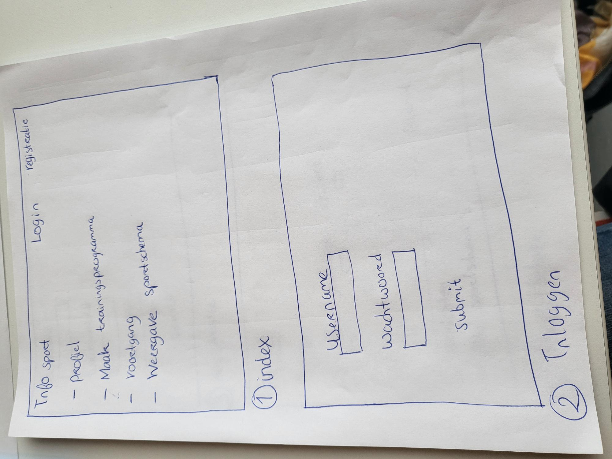
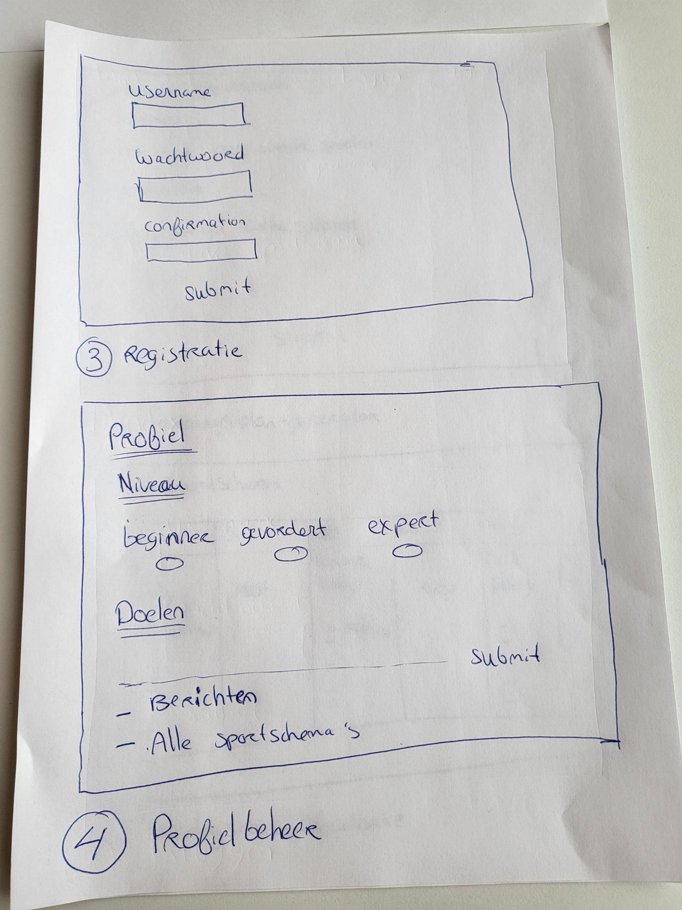
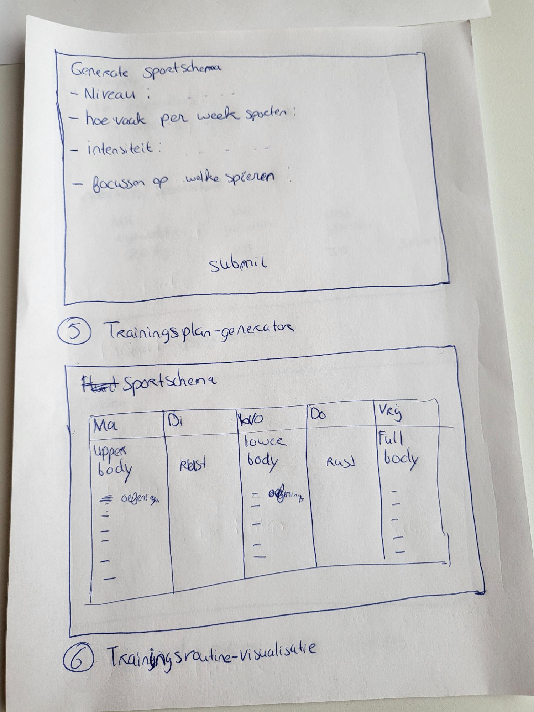
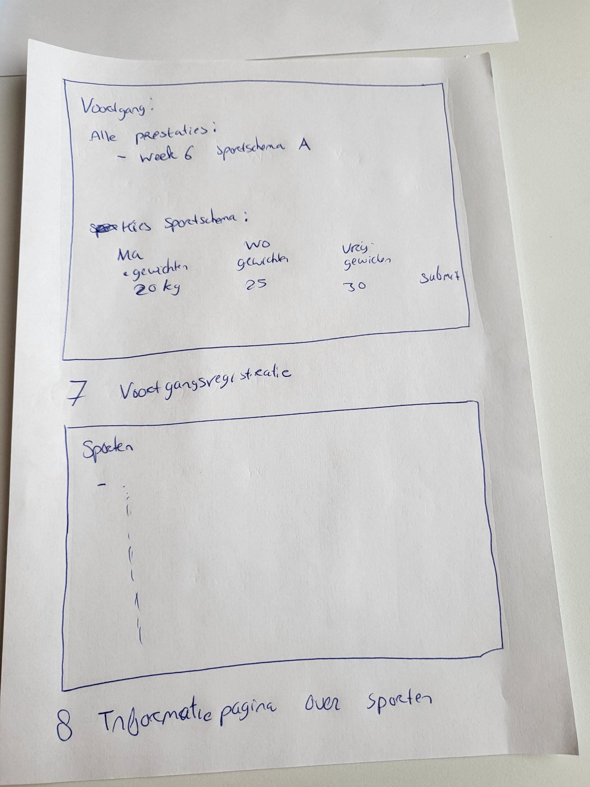

# Project: Persoonlijke sportschema's aanmaken van Deveney Etnel

## Projectvoorstel: 
## Wat vragen

1.  Wat is **het probleem** (niet de oplossing) dat jouw project gaat oplossen. Wees duidelijk en specifiek. Een paar abstracte voorbeelden:

Op het internet zijn veel fitnessprogramma's en sportschema's beschikbaar, maar het vinden van gepersonaliseerde schema's die passen bij individuele fitnessniveaus en doelen blijft een uitdaging. Vaak zijn ze te algemeen en niet specifiek afgestemd op beginners, gevorderden of experts, waardoor het moeilijk is voor gebruikers om een geschikt programma te vinden.

Het ontbreken van gepersonaliseerde sportschema's voor mensen van verschillende fitnessniveaus kan leiden tot verwarring en minder effectieve trainingen. Zonder een specifiek plan op maat kunnen gebruikers zich verloren voelen, vooral beginners, wat kan leiden tot demotivatie en blessures. Het is cruciaal om een oplossing te bieden die gepersonaliseerde trainingsplannen creëert die passen bij individuele behoeften en doelen.

* Voorbeeld: Door te vragen hoe vaak de gebruiker wil trainen, kan er een sportschema worden opgesteld dat aansluit bij de beschikbare tijd en doelen van de gebruiker. Stel dat een gebruiker aangeeft dat ze drie dagen per week willen sporten, dan kan er een schema worden gemaakt met de beste oefeningen voor die dagen.

2.  Wie zijn je verwachte gebruikers? In andere woorden, voor wie bouw je dit project? Bijvoorbeeld:

Mijn project richt zich op mensen die op zoek zijn naar nauwkeurige en op maat gemaakte fitnessplannen, ongeacht hun ervaringsniveau. Of je nu net begint met trainen en begeleiding nodig hebt om te beginnen, of een ervaren gebruiker bent die zijn of haar training naar een hoger niveau wil tillen, dit project biedt een oplossing die aan jouw specifieke behoeften voldoet.

3.  In welke setting wordt je project gebruikt? Een paar voorbeelden:

Het project is met name bedoeld voor gebruik op desktopcomputers of laptops, waar gebruikers toegang hebben tot een ruim scherm en een toetsenbord om gegevens in te voeren en schema's te bekijken

4.  Wat doet jouw oplossing anders of beter dan bestaande oplossingen? Wat is je niche? Bijvoorbeeld:

Mijn project wil het gebrek aan gepersonaliseerde sportschema's voor mensen van verschillende fitnessniveaus aanpakken. Het biedt een oplossing door gebruikers in staat te stellen hun fitnessniveau en trainingsvoorkeuren in te voeren, waarna het een gepersonaliseerd schema genereert dat past bij hun behoeften en doelen. Mijn project onderscheidt zich, omdat het zich richt op personalisatie en aanpassing aan verschillende fitnessniveaus. In plaats van een standaard aanpak, biedt het maatwerk op basis van de input van de gebruiker, waardoor het beter past bij individuele behoeften.
  
## Schets je oplossing

**Oplossingssamenvatting:**

Mijn applicatie zal een webgebaseerde platform bieden voor het genereren van gepersonaliseerde sportschema's voor gebruikers van verschillende fitnessniveaus. Het doel is om verwarring en inefficiëntie in trainingen te verminderen, vooral voor beginners die niet weten waar te beginnen. Gebruikers kunnen hun fitnessniveau en trainingsvoorkeuren invoeren, waarna het systeem een op maat gemaakt trainingsplan genereert dat past bij hun behoeften en doelen.

Schetsen van de Gebruikerservaring:

1.  Index: 
* Schets van de homepage met de mogelijkheid om in te loggen en te registreren. 
* Na het inloggen verschijnt de huidige sportschema.
* Is er een verwijzing naar profiel, trainingsplan-generator, weergave sportschema, voortgang en algemene informatie over sporten.

2.	Inloggen:
* Schets van de inlogpagina met opties voor bestaande gebruikers om in te loggen.

3.  Registratie:
* Schets van de registratiepagina met invoervelden voor gebruikersgegevens.

4.	Profielbeheer:
* Schets van de profielpagina waar gebruikers hun fitnessniveau, doelen en voorkeuren kunnen bijwerken.
* Hier worden ook alle sportschema's opgeslagen die al voor de gebruiker zijn gegenereerd. Hier kun je ook sportschema's verwijderen.
* Hier komen berichten binnen.

5.	Trainingsplan-generator:
* Schets van de pagina waar gebruikers hun trainingsvoorkeuren invoeren, zoals trainingsfrequentie, intensiteit en type oefeningen.

6.  Trainingsroutine-visualisatie:
* Schets van de pagina waar het gepersonaliseerde trainingsplan wordt weergegeven, inclusief specifieke oefeningen, sets, herhalingen en rustperiodes.

7.	Voortgangsregistratie:
* Schets van de pagina waar gebruikers hun trainingsvoortgang kunnen registreren, inclusief voltooide workouts, gewichten, reps en eventuele opmerkingen.

8.	Informatiepagina over sporten:
* Schets van de informatiepagina met tips en richtlijnen voorbereiden voor, tijdens en na een workout.

## Features

**Features die moeten bestaan:**

1.  Gebruikersregistratie en -login: Functionaliteit om gebruikersaccounts aan te maken en in te loggen, zodat persoonlijke trainingsplannen kunnen worden opgeslagen en toegankelijk zijn voor individuele gebruikers.

2.	Profielbeheer: Mogelijkheid voor gebruikers om hun profielinformatie te beheren, waaronder fitnessniveau, trainingsdoelen en voorkeuren.

3.	Trainingsplan-generator: Feature om op maat gemaakte trainingsplannen te genereren op basis van het fitnessniveau, de doelen en voorkeuren van de gebruiker.

4.	Fitnessniveau-beoordeling: Functionaliteit om het fitnessniveau van de gebruiker te beoordelen op basis van ingevoerde gegevens of een test, om een gepersonaliseerd trainingsschema te genereren. Dit wordt niet door de gebruiker gezien. 

5.	Trainingsroutine-visualisatie: Mogelijkheid om de trainingsroutine visueel weer te geven, inclusief oefeningen, sets, herhalingen en rustperiodes.

**Features die zouden moeten bestaan:**

1.	Dagelijkse feedback: Mogelijkheid voor gebruikers om dagelijkse feedback te geven over hun trainingssessies, waardoor het systeem kan leren en toekomstige schema's kan aanpassen op basis van de gebruikerservaring.

2.	Progressiegrafieken: Feature om voortgangsgrafieken en statistieken weer te geven, zodat gebruikers hun verbeteringen in de tijd kunnen volgen en analyseren.

3.	Aanpasbare trainingsopties: Mogelijkheid voor gebruikers om specifieke trainingsvoorkeuren aan te passen, zoals trainingsdagen, oefeningen en intensiteit, om het schema verder te personaliseren.

4.  Video-instructies: Geïntegreerde video's of links naar trainingsinstructies voor elke oefening om gebruikers te begeleiden bij het correct uitvoeren van de oefeningen.

5.	Voortgangsregistratie: Functionaliteit voor gebruikers om hun trainingsvoortgang bij te houden, inclusief voltooide workouts, gewichten, reps en eventuele opmerkingen over de sessie.

6.	Informatiepagina over sporten: Een speciale pagina met informatie over sporten, inclusief tips voorbereiden voor, tijdens en na een workout, om gebruikers te voorzien van nuttige richtlijnen en advies.

## Requirements

**Gegevensbronnen:**

1.	Fitnessinformatie en trainingsadvies:
*	Websites van erkende fitnessorganisaties.
*	Wetenschappelijke artikelen over fitness en krachttraining.
*	Boeken over fitness en krachttraining.
*	YouTube-video's met uitleg over fitnessapparatuur en oefeningstechnieken.
*	Toegang: Deze informatie is vrij beschikbaar op het internet en in bibliotheekdatabases. Voor websites van erkende fitnessorganisaties zal ik directe links naar specifieke artikelen en bronnen verzamelen en opslaan. Wetenschappelijke artikelen en boeken over fitness en krachttraining kunnen worden gevonden via online databases en bibliotheekcatalogi. Voor YouTube-video's zal ik relevante video's verzamelen en linken naar de bronnenpagina's voor gebruik in het project.

2.   Gebruikersgegevens: Het opslaan van gebruikersgegevens zoals profielinformatie, trainingsvoorkeuren en voortgangsregistratie in een database. 

3. Exercise Database APIs: ExerciseDB API, een uitgebreide database van oefeningen en workouts, samen met gedetailleerde informatie over elk. 

4. User Authentication & Authorization APIs: Voor het beveiligen van gebruikersgegevens en het beheren van gebruikersaccounts.

**Externe componenten:**

1.  React.js: Een JavaScript-bibliotheek voor het bouwen van gebruikersinterfaces.

2.  Bootstrap: Voor het ontwerpen van responsieve en gebruiksvriendelijke websites en webapplicaties. Speciaal voor het vormgeven en stylen van de gebruikersinterface van het project.

3.  Node.js met Express.js: Node.js wordt gebruikt als runtime-omgeving voor het uitvoeren van JavaScript-code buiten de browser, terwijl Express.js wordt gebruikt als webapplicatieframework voor het bouwen van de backend van het project.

4.  PostgreSQL: Een relationeel databasebeheersysteem voor het opslaan en beheren van gebruikersgegevens, trainingsplannen en andere relevante informatie. PostgreSQL wordt gebruikt als de database voor het project.

5.  JWT (JSON Web Tokens): JWT wordt gebruikt voor het authenticeren van gebruikers tijdens het inlogproces en voor het genereren van toegangstokens voor beveiligde routes in de applicatie.

## Wat wordt moeilijk?

1.  Het maken van de Fitnessniveau-beoordeling:
* Het moeilijk is om te bepalen hoe fit iemand is. Om dit te doen, moeten er dus slimme vragen gestelt worden of tests bedenken die nauwkeurig meten hoe goed iemand kan sporten. Het is ook ingewikkeld om te beslissen welke dingen gemeten moeten worden, zoals leeftijd, geslacht en hoeveel ervaring iemand heeft met sporten. Daarna moeten deze metingen gebruikt worden om een trainingsplan te maken dat precies bij de persoon past.

2.  Het gebruik van de ExerciseDB API:
* Deze API helpt bij het vinden van oefeningen en workouts voor de gebruiker. Maar omdat er zoveel informatie is en mensen verschillende voorkeuren hebben, kan het lastig zijn om de juiste oefeningen te vinden. Ook is het moeilijk om al deze informatie op een handige manier aan de gebruiker te laten zien.

## Finishing up

* Geef je project een naam en schrijf natuurlijk ook je eigen naam op.
* Run een spellchecker en kijk nog even naar de Markdown preview. 
* Zorg ervoor dat plaatjes niet te groot of te klein zijn in het voorstel.
* Dubbelcheck dat alle gevraagde onderdelen van het voorstel bestaan.

